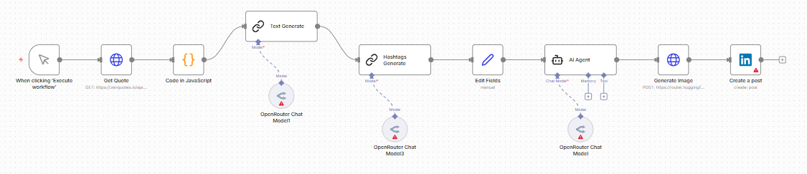

# LinkedIn AI Post Generator – Automated LinkedIn Content Creation
This workflow automatically generates professional motivational LinkedIn posts using **n8n**, **OpenRouter AI** and **FLUX Image Generation** — producing quotes, explanations, hashtags, AI images and posting them to LinkedIn without manual effort.
## 🚀 Features
- Fetches motivational quotes automatically  
- Generates a cinematic visual description using AI  
- Creates high-quality images using **FLUX.1 (HuggingFace Router)**  
- Produces a professional 60–120 word motivational caption  
- Generates 12–18 curated hashtags  
- Combines quote + caption + hashtags into a final post  
- Automatically posts to **LinkedIn** with the image
- 
## ⚙️ Workflow Overview
**Quote API → JavaScript Parse → AI Explanation → AI Hashtags → Merge Caption → AI Image Description → FLUX Image Generation → LinkedIn Publish**

## 🧭 Workflow Diagram


## 🎥 Demo Video
[▶️ Click here to view the demo](demo.mp4) 

## 🧩 Tech Stack
- **n8n** – Automation engine  
- **OpenRouter (LLM)** – AI explanation + hashtags  
- **FLUX.1 Schnell (HuggingFace Router)** – Cinematic image generation  
- **JavaScript (n8n Code Node)** – Quote parsing  
- **LinkedIn API (OAuth 2.0)** – Auto publishing
- 
## 🧠 Key Highlights
- Generates viral-style LinkedIn content automatically  
- Cinematic artwork with **no text inside the image**  
- Motivational explanations written in a professional tone  
- Fully automated end-to-end posting pipeline  
- Perfect for daily content posting
-   
## 🖼️ Example Output
### Caption Example
```
The less you open your heart to others, the more your heart suffers.
— Deepak Chopra

True strength begins with vulnerability. When we shut people out, we create walls that isolate us from growth and healing. Opening your heart is an act of courage that invites clarity, connection, and emotional freedom.
```
### Hashtags Example
`#motivation #mindset #psychology #growthmindset #lifelessons #selfimprovement #habits #inspiration #learning #wisdom`

### Image Example
*(Generated using **FLUX.1 Schnell**, no text inside the image)*  


## 🧑‍💻 Author
**Muhammad Musab**  
🌐 https://github.com/muhammadmusabyaqoob
## 🏷️ Tags
`n8n` `OpenRouter` `FLUX` `AI` `Automation` `LinkedIn` `Content Generator` `Workflow`
## 🌟 Badges
  
  
  

